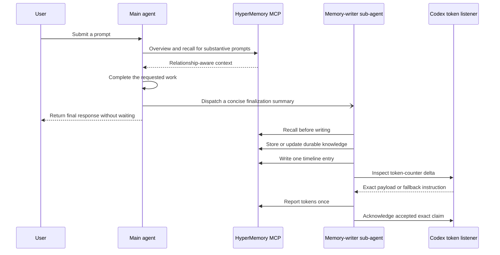
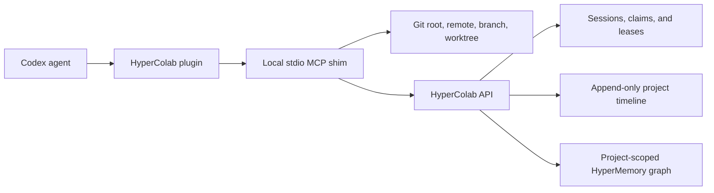
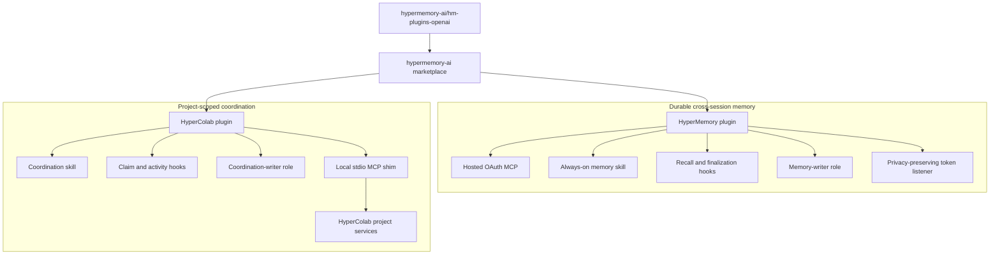

<p align="center">
  
  &nbsp;&nbsp;&nbsp;&nbsp;
  
</p>

<h1 align="center">HyperMemory AI plugins for ChatGPT and Codex</h1>

<p align="center">
  Durable, relationship-aware memory for every conversation.<br />
  Shared project context and collision-safe coordination for every repository.
</p>

<p align="center">
  <a href="https://github.com/hypermemory-ai/hm-plugins-openai/actions/workflows/validate.yml"></a>
  <a href="LICENSE"></a>
  
  
</p>

> [!IMPORTANT]
> This repository is the Git-backed development marketplace for ChatGPT and
> Codex. HyperMemory currently connects to the hosted staging MCP at
> `https://stage.hypermemory.io/mcp`. Public, one-click installation for normal
> ChatGPT and Codex users requires separate publication of each plugin through
> OpenAI's universal Plugins Directory.

## Contents

- [What this repository provides](#what-this-repository-provides)
- [Why two plugins?](#why-two-plugins)
- [Capability matrix](#capability-matrix)
- [Supported surfaces](#supported-surfaces)
- [Quick start](#quick-start)
- [HyperMemory](#hypermemory)
- [HyperColab](#hypercolab)
- [Combined architecture](#combined-architecture)
- [Repository layout](#repository-layout)
- [Authentication and secrets](#authentication-and-secrets)
- [Updating](#updating)
- [Removing](#removing)
- [Development](#development)
- [Release and publication model](#release-and-publication-model)
- [Troubleshooting](#troubleshooting)
- [Frequently asked questions](#frequently-asked-questions)
- [Documentation](#documentation)
- [Support and security](#support-and-security)

## What this repository provides

This repository is one plugin marketplace containing two independently
installable OpenAI plugins:

| Plugin | Package ID | Current version | Purpose |
| --- | --- | ---: | --- |
| **HyperMemory** | `hypermemory@hypermemory-ai` | `2.8.0` | Persistent personal and project memory, relationship-aware recall, delegated writes, timeline logging, and token telemetry |
| **HyperColab** | `hypercolab@hypermemory-ai` | `2.8.0` | Shared project context, work ownership, path claims, project timelines, graph search, and multi-agent collision prevention |

The marketplace is named `hypermemory-ai`. A marketplace is a catalog and
source of plugins; registering it does **not** install either plugin. Users add
the marketplace once, then choose HyperMemory, HyperColab, or both.

```text
GitHub repository                     Marketplace              Installable plugins
hypermemory-ai/hm-plugins-openai  ->  hypermemory-ai       ->  hypermemory
                                                            ->  hypercolab
```

## Why two plugins?

HyperMemory and HyperColab share a graph-oriented foundation, but they solve
different problems and have different runtime boundaries:

- **HyperMemory follows a person or agent across conversations.** It recalls
  durable context before work begins and maintains that context after each
  turn.
- **HyperColab follows a Git project.** It resolves the active repository,
  coordinates concurrent developers and coding agents, protects claimed paths,
  and records a structured development timeline.

Keeping them separate lets a user install durable memory without repository
coordination, add coordination only where needed, or run both together.

## Capability matrix

| Capability | HyperMemory | HyperColab |
| --- | :---: | :---: |
| Hosted OAuth MCP | Yes | No |
| Local stdio MCP shim | No | Yes |
| Bundled skills | Main agent + memory writer | Coordination |
| Codex lifecycle hooks | Yes | Yes |
| Packaged sub-agent role contract | Memory writer | Coordination writer |
| Relationship-aware graph | Personal and cross-session | Project-scoped |
| Chronological timeline | Conversation and decision timeline | Development activity timeline |
| Exact local Codex token deltas | Yes | No |
| Path claims and collision protection | No | Yes |
| Git event capture | No | Optional |
| Works without the other plugin | Yes | Yes |

## Supported surfaces

| Surface | HyperMemory | HyperColab |
| --- | --- | --- |
| Codex CLI | Full local behavior after MCP authorization and hook trust | Full behavior after CLI installation, login, plugin installation, and hook trust |
| Codex in the ChatGPT desktop app | Supported where local plugins, MCP, hooks, and sub-agents are available | Supported when the local environment can launch `hypercolab` and access the repository |
| ChatGPT developer/workspace testing | Hosted MCP and skill can be tested | Skill can be tested; repository coordination requires a local process and Git checkout |
| Public Plugins Directory | Requires publication through OpenAI's submission flow | Requires a publication design compatible with the target surface's MCP transport |
| ChatGPT web without a local coding environment | Hosted HyperMemory MCP can work after publication | Local Git claims and activity capture are unavailable |

## Quick start

### Prerequisites

- A current Codex CLI or Codex-enabled ChatGPT desktop app
- A HyperMemory account
- Git
- Python 3.10 or newer and [`pipx`](https://pipx.pypa.io/) for HyperColab

### 1. Register the marketplace

Run this once:

```bash
codex plugin marketplace add hypermemory-ai/hm-plugins-openai
```

Confirm Codex can see it:

```bash
codex plugin marketplace list
```

### 2. Install HyperMemory

```bash
codex plugin add hypermemory@hypermemory-ai
```

Complete the HyperMemory OAuth flow when prompted, then start a new task.

### 3. Install HyperColab

HyperColab needs its local CLI/MCP shim before Codex loads the plugin:

```bash
pipx install "git+https://github.com/hypermemory-ai/hm-plugins-openai.git#subdirectory=packages/hypercolab-cli"
hypercolab login
hypercolab doctor
codex plugin add hypercolab@hypermemory-ai
```

Start a new task inside a Git repository that is enrolled in HyperColab.

### 4. Review and trust hooks

In Codex CLI, run:

```text
/hooks
```

Review each plugin's hook definition and trust the hooks you want to run. Codex
does not automatically trust non-managed plugin hooks. Trust is tied to the
exact hook definition, so changed hooks require review again after an update.

### 5. Verify the installation

```bash
codex plugin list
hypercolab status
```

Try these prompts in a new task:

```text
What do you remember about this project?
```

```text
Join this HyperColab project, sync active work, and claim the files needed for my task.
```

For a step-by-step guide, see [Installation](docs/INSTALLATION.md).

## HyperMemory

HyperMemory adds durable, relationship-aware memory to ChatGPT and Codex. It is
designed to recall the right context before a response and preserve important
knowledge after the requested work is complete.

### Included components

| Component | Path | Responsibility |
| --- | --- | --- |
| Plugin manifest | `plugins/hypermemory/.codex-plugin/plugin.json` | Identity, version, discovery metadata, branding, skill path, and MCP declaration |
| MCP configuration | `plugins/hypermemory/.mcp.json` | Connects to the hosted staging MCP over HTTP |
| Main-agent skill | `plugins/hypermemory/skills/hypermemory/` | Defines recall and fire-and-forget delegation behavior |
| Memory-writer skill | `plugins/hypermemory/skills/memory-writer/` | Parent-only finalization workflow with implicit invocation disabled |
| Lifecycle hooks | `plugins/hypermemory/hooks/hooks.json` | Silently prepares recall context and per-turn telemetry jobs before model work |
| Memory-writer role | `plugins/hypermemory/agents/memory-writer.md` | Detailed contract for delegated graph hygiene, storage, timeline, and telemetry work |
| Hook bridge | `plugins/hypermemory/scripts/hypermemory_hook.py` | Creates hidden lifecycle context and bounded finalization jobs without Stop continuations |
| Token listener | `plugins/hypermemory/scripts/codex_token_listener.py` | Reads exact local Codex token-counter deltas without reading chat content |

### Turn lifecycle



The main agent performs recall for substantive prompts because remembered
context must be available while reasoning about the user's request. Narrow,
standalone greetings and acknowledgements skip retrieval. Persistence and
telemetry move to one fire-and-forget memory-writer sub-agent so they do not
delay the user-facing response. Each turn uses a fresh, turn-unique writer with
`fork_turns="none"`; reusing a writer or copying the full parent history would
repeatedly charge that context during tool continuations. The role contract
prevents recursive delegation.

This coordination is deliberately invisible in normal use. HyperMemory does
not emit status messages, inject synthetic user prompts, or append memory
completion notices to user-facing answers.

### Memory operations

The skill uses the HyperMemory MCP for:

- graph overview and relevant recall;
- exact-node hydration and relationship traversal;
- durable storage and correction of existing knowledge;
- graph relationships and orphan cleanup;
- chronological timeline entries;
- user-requested file storage; and
- per-turn token telemetry.

The hosted MCP currently exposes these tool families:

| Area | Tools |
| --- | --- |
| Recall and context | `hm_get_overview`, `hm_recall`, `hm_get_nodes`, `hm_get_chat_context`, `hm_find_related` |
| Graph writes and hygiene | `hm_store`, `hm_update`, `hm_forget`, `hm_add_relationships`, `hm_ingest`, `hm_list_orphans` |
| Timeline | `hm_timeline`, `hm_timeline_write` |
| Files | `hm_upload_file`, `hm_list_files` |
| Structured data | `hm_tabular` |
| Skill distribution | `hm_skill` |
| Telemetry | `hm_tokens` |

These are the public tools currently advertised by the hosted MCP through
`tools/list`. Internal-only operations are deliberately absent.

Writes follow canonical node types and stable keys. The writer recalls before
changing the graph, updates existing nodes instead of duplicating them, and
gives each new node a specific relationship. File upload is used only when the
user explicitly asks to store a file.

### OAuth and credentials

The plugin connects to:

```text
https://stage.hypermemory.io/mcp
```

The hosted MCP supports authorization-code OAuth with PKCE and refresh tokens.
ChatGPT and Codex own client metadata, callback selection, and credential
storage for their surface. The plugin package contains only the server URL; it
does not contain or require a checked-in API key.

### Codex token telemetry

Codex persists cumulative usage counters in local rollout JSONL files. The
listener reads only `session_meta` and `token_count` records from the logical
session's parent and memory-writer rollouts. It does not return or upload:

- prompts or model responses;
- tool arguments or tool results;
- source code or file contents; or
- complete transcripts.

Reporting uses a two-phase inspect/ack protocol:

1. Inspect computes the delta since the last acknowledged checkpoint.
2. The memory-writer sends that payload to `hm_tokens` exactly once.
3. Ack advances the checkpoint only after the MCP accepts the report.

Cached input is reported separately in `cache_tokens`; it is excluded from
`input_tokens` and `total_tokens` so repeated context cannot masquerade as new
token spend. Rollouts are checkpointed by stable physical session ID so moving
a transcript into the archive cannot replay its cumulative counter. A bounded
fresh-token safety limit rejects implausible per-turn spikes instead of sending
them as exact usage.

If reporting fails, the checkpoint does not advance and usage remains eligible
for a later retry. Tokens generated after the final inspection are carried into
the next successful report. If the session has no later turn, that final tail
can remain unreported; the plugin never labels a guess as client-exact to hide
this host limitation.

Consumer ChatGPT does not expose Codex's local rollout counters. On that
surface, HyperMemory reports an uncertainty-labelled estimate instead of
claiming exact or provider-actual usage.

### Always-on behavior and its boundary

HyperMemory uses three complementary layers:

1. The skill declares itself applicable on every turn.
2. Session and prompt hooks privately remind the active agent to recall and
   prepare the current turn's token-listener job.
3. The skill requires delegated memory finalization before the response is
   released; no blocking `Stop` continuation is used.

This is the strongest enforcement available to an installed plugin, but it is
not an operating-system guarantee. If the plugin is disabled, its hooks are not
trusted, hooks are disabled by policy, the MCP is unavailable, or the current
surface cannot spawn sub-agents, behavior degrades accordingly. The skill
defines a direct-write fallback when delegation is unavailable so memory is not
silently abandoned.

## HyperColab

HyperColab coordinates human developers and coding agents working in the same
Git project. It combines shared context, explicit work ownership, atomic path
claims, structured activity, and project-scoped graph search.

### Included components

| Component | Path | Responsibility |
| --- | --- | --- |
| Plugin manifest | `plugins/hypercolab/.codex-plugin/plugin.json` | Identity, version, discovery metadata, branding, skill path, and MCP declaration |
| MCP registration | `plugins/hypercolab/.mcp.json` | Launches `hypercolab mcp` as a local stdio server |
| Skill | `plugins/hypercolab/skills/hypercolab/` | Defines join, sync, claim, progress, activity, and completion behavior |
| Lifecycle hooks | `plugins/hypercolab/hooks/hooks.json` | Loads project context, checks writes, and records structured activity |
| Coordination-writer role | `plugins/hypercolab/agents/coordination-writer.md` | Bounded contract for delegated timeline maintenance |
| Hook launcher | `plugins/hypercolab/scripts/hypercolab_hook.py` | Bridges Codex lifecycle events to the installed CLI and degrades safely if absent |
| CLI and MCP shim | `packages/hypercolab-cli/` | OAuth, Git discovery, MCP tools, direct commands, claims, offline leases, and Git hooks |

### Why a local shim?

HyperColab must know which repository the user is actually working in. The
local shim derives the Git root, canonical remote, branch, and worktree before
calling the project service. Agents do not select arbitrary graph or timeline
database identifiers.



This routing is a safety boundary: the backend resolves the authorized project
from the authenticated developer and canonical repository identity.

### MCP tool reference

| Tool | Purpose |
| --- | --- |
| `colab_join` | Join the project associated with the current Git repository and publish the work goal |
| `colab_sync` | Retrieve active sessions, ownership, recent events, and touch/do-not-touch guidance |
| `colab_claim` | Atomically claim repository-relative files or directories before editing |
| `colab_check` | Check create, modify, rename, or delete operations immediately before a write |
| `colab_update` | Publish material progress, scope, status, rationale, and claim renewal |
| `colab_finish` | Complete, release, abandon, or hand off work and release the claim |
| `colab_log_activity` | Append a structured project event for decisions, discoveries, tests, commits, or releases |
| `colab_timeline` | Read or search the chronological development record |
| `colab_graph_search` | Search durable knowledge in the project-scoped graph |

### Coordination lifecycle

The main agent joins and synchronizes before planning, then claims intended
paths before editing. Join, sync, and claim operations stay on the main agent
because their results affect planning and write safety. Routine progress and
timeline maintenance may be delegated to one awaited coordination writer.

```text
join -> sync -> claim -> check before writes -> update during work -> finish or hand off
```

Live conflicts are not bypassed. If another session owns an overlapping path,
the agent coordinates a handoff, waits for lease expiry, or changes scope.

### Lifecycle and Git hooks

The plugin hooks cover:

- `SessionStart`: load the current project brief;
- `PreToolUse`: check inferred file operations and claims before writes;
- `PostToolUse`: record structured completion or Git-push events; and
- `Stop`: record that the coding session stopped.

The optional repository Git hooks record non-blocking events such as commits,
checkouts, merges, rewrites, and pushes:

```bash
hypercolab hooks install
```

Remove them before uninstalling the CLI:

```bash
hypercolab hooks uninstall
```

### Offline behavior

HyperColab treats coordination conservatively during an outage:

- new path claims fail closed;
- a previously approved cached lease is honored only until its server-issued
  expiration;
- Git activity is queued locally and retried later; and
- repositories that are not registered with HyperColab remain unaffected.

### CLI command reference

| Command | Purpose |
| --- | --- |
| `hypercolab login` / `logout` | Create or remove the local OAuth session |
| `hypercolab status` | Show authentication, Git, project, and session state |
| `hypercolab doctor` | Check the CLI, Git, authentication, API URL, and repository without modifying it |
| `hypercolab setup` | Add project-scoped Codex MCP configuration and install Git activity hooks |
| `hypercolab join` | Join the project resolved from the active Git remote |
| `hypercolab sync` / `who` | Read current coordination state and active sessions |
| `hypercolab claim` / `check` | Claim paths or check an intended file operation |
| `hypercolab update` | Publish progress, status, paths, and visible rationale |
| `hypercolab finish` / `release` | Complete, hand off, abandon, or release claimed work |
| `hypercolab timeline` | Read or search the project timeline |
| `hypercolab timeline add` | Append a deliberate structured timeline event |
| `hypercolab graph search` | Search the project-scoped durable graph |
| `hypercolab hooks install` / `uninstall` | Manage optional repository Git hooks |
| `hypercolab mcp` | Run the local stdio MCP shim used by the plugin |

### Data boundary

HyperColab records structured summaries, repository-relative paths, commit
identifiers, claims, statuses, test results, small metadata objects, and visible
rationale summaries. By default it does not send raw source, raw diffs, full
shell output, complete transcripts, or hidden model reasoning.

## Combined architecture



The plugins may be enabled independently. When both are enabled, HyperMemory
retains durable conversational context while HyperColab supplies the live,
repository-specific coordination state.

## Repository layout

```text
.
├── .agents/plugins/marketplace.json       # Shared Git marketplace catalog
├── .github/workflows/validate.yml         # Lint, test, and archive CI
├── plugins/
│   ├── hypermemory/
│   │   ├── .codex-plugin/plugin.json      # HyperMemory manifest
│   │   ├── .mcp.json                      # Hosted OAuth MCP connection
│   │   ├── agents/                        # Memory-writer role contract
│   │   ├── assets/                        # Marketplace icon and logo
│   │   ├── hooks/hooks.json               # Codex lifecycle hooks
│   │   ├── scripts/                       # Hook bridge and token listener
│   │   └── skills/                        # Main-agent and parent-only writer skills
│   └── hypercolab/
│       ├── .codex-plugin/plugin.json      # HyperColab manifest
│       ├── .mcp.json                      # Local stdio MCP registration
│       ├── agents/                        # Coordination-writer role contract
│       ├── assets/                        # Marketplace icon and logo
│       ├── hooks/hooks.json               # Codex coordination hooks
│       ├── scripts/                       # Graceful hook launcher
│       └── skills/hypercolab/             # Coordination workflow and references
├── packages/hypercolab-cli/               # Installable CLI and local MCP shim
├── docs/
│   ├── ARCHITECTURE.md                    # Runtime design and trust boundaries
│   ├── INSTALLATION.md                    # Detailed setup and troubleshooting
│   └── MARKETPLACE.md                     # Catalog and release maintenance
├── scripts/build_plugin_archives.py       # Deterministic review ZIP builder
├── tests/                                 # Marketplace and lifecycle tests
├── AGENTS.md                              # Repository rules for coding agents
├── CONTRIBUTING.md                        # Contribution and release checklist
├── SECURITY.md                            # Vulnerability reporting and boundaries
└── LICENSE                                # MIT license
```

Only `plugin.json` lives inside each `.codex-plugin/` directory. Skills, MCP
configuration, hooks, assets, scripts, and role contracts remain at the plugin
root according to the Codex plugin package layout.

## Agent role packaging

Each plugin contains an `agents/` role contract and a matching skill reference:

- HyperMemory uses `memory-writer` for storage, timeline, and telemetry.
- HyperColab uses `coordination-writer` for project activity maintenance.

These files document the bounded role that the skill asks the host to spawn.
They are not a separate manifest-level custom-agent registry: the current
OpenAI plugin manifest packages skills, MCP servers, hooks, apps, and assets,
but does not auto-install arbitrary project-scoped agent TOML files. The skill
therefore controls when delegation happens, what information is passed, and how
recursive delegation is prevented.

## Authentication and secrets

| Component | Authentication | Where credentials live |
| --- | --- | --- |
| HyperMemory MCP | OAuth authorization code with PKCE | Codex/host MCP credential storage |
| HyperColab CLI | `hypercolab login` OAuth flow with PKCE | OS keyring, with a restricted local fallback when no keyring is available |
| Git marketplace | Public GitHub repository | No credentials required for this repository |

No access token, refresh token, client secret, API key, or reviewer credential
belongs in this repository. See [Security](SECURITY.md) for reporting and trust
boundaries.

## Hook trust and permissions

Plugin installation does not automatically trust bundled command hooks. Users
must review them with `/hooks`. This provides an explicit boundary around local
commands that can inspect token counters, query Git state, or check write
ownership.

Administrators may disable hooks or restrict marketplace/MCP sources through
managed Codex policy. Sub-agents inherit the active parent sandbox and
permission mode. Neither plugin expands operating-system permissions on its
own.

## Updating

Refresh the Git marketplace snapshot, reinstall the plugins you use, and start
a new task:

```bash
codex plugin marketplace upgrade hypermemory-ai
codex plugin add hypermemory@hypermemory-ai
codex plugin add hypercolab@hypermemory-ai
pipx upgrade hypercolab
```

Review hooks again if their definitions changed.

## Removing

If you installed HyperColab Git hooks, remove those first while the CLI is still
available:

```bash
hypercolab hooks uninstall
```

Then remove the plugins, marketplace, and optional CLI:

```bash
codex plugin remove hypermemory@hypermemory-ai
codex plugin remove hypercolab@hypermemory-ai
codex plugin marketplace remove hypermemory-ai
pipx uninstall hypercolab
```

Removing a plugin or marketplace does not delete durable data already stored by
HyperMemory or HyperColab.

## Development

### Clone and create an environment

```bash
git clone https://github.com/hypermemory-ai/hm-plugins-openai.git
cd hm-plugins-openai
python3 -m venv .venv
source .venv/bin/activate
python -m pip install -e "packages/hypercolab-cli[dev]"
```

### Run the test suite

```bash
ruff check plugins packages tests scripts
pytest -q
```

The tests cover:

- catalog-to-plugin path and identity consistency;
- required manifests, MCP declarations, hooks, skills, and assets;
- HyperMemory prompt classification and fire-and-forget writer delegation;
- exact token aggregation and two-phase checkpointing;
- HyperColab hook behavior, Git discovery, cached leases, and queued events;
- logo format and dimensions; and
- graceful behavior when the HyperColab CLI is missing.

### Run Codex package validators

```bash
python3 ~/.codex/skills/.system/plugin-creator/scripts/validate_plugin.py \
  plugins/hypermemory
python3 ~/.codex/skills/.system/plugin-creator/scripts/validate_plugin.py \
  plugins/hypercolab
python3 ~/.codex/skills/.system/skill-creator/scripts/quick_validate.py \
  plugins/hypermemory/skills/hypermemory
python3 ~/.codex/skills/.system/skill-creator/scripts/quick_validate.py \
  plugins/hypermemory/skills/memory-writer
python3 ~/.codex/skills/.system/skill-creator/scripts/quick_validate.py \
  plugins/hypercolab/skills/hypercolab
```

### Build review archives

```bash
python scripts/build_plugin_archives.py
```

This creates deterministic ZIP archives in `dist/`. Marketplace installation
uses the source directories referenced by `marketplace.json`, so checked-in
`.plugin` files are not required. Generated archives remain ignored to avoid
stale binary packages.

### Test a local marketplace checkout

In a clean development profile, or after removing another configured source
with the same marketplace name, run from the repository root:

```bash
codex plugin marketplace add .
codex plugin add hypermemory@hypermemory-ai
codex plugin add hypercolab@hypermemory-ai
```

Start a new task after reinstalling so Codex loads the updated skills and MCP
configuration.

## Release and publication model

There are two distinct distribution paths:

1. **Git marketplace:** this repository supports local authoring, Codex
   installation, team testing, and controlled pre-publication distribution.
2. **Universal Plugins Directory:** each plugin is submitted and reviewed
   independently for public, one-click discovery across supported ChatGPT and
   Codex surfaces.

Plugin versions live in each `.codex-plugin/plugin.json`; the marketplace does
not have a shared plugin version. Increment only the package that changed,
validate its complete file tree, build a fresh review archive, test a clean
installation, and document user-visible changes.

HyperMemory should use OpenAI's **With MCP** submission path because it combines
a hosted MCP server with a skill. HyperColab's public submission must preserve
its repository-identity safety boundary while using a transport supported by
the target public surface.

See [Marketplace maintenance](docs/MARKETPLACE.md) and
[Contributing](CONTRIBUTING.md) for the complete release checklist.

## Troubleshooting

### The marketplace was added, but no plugin is installed

That is expected. Registering the marketplace adds the catalog only. Install a
plugin explicitly:

```bash
codex plugin add hypermemory@hypermemory-ai
codex plugin add hypercolab@hypermemory-ai
```

### MCP tools are missing

Confirm that the plugin is installed and enabled with `codex plugin list`, then
start a new task. HyperColab also requires the `hypercolab` executable to be on
`PATH`; run `hypercolab doctor` to verify its prerequisites.

### HyperMemory OAuth did not open

Invoke a HyperMemory MCP operation and complete the connection flow. Confirm
the installed MCP URL is `https://stage.hypermemory.io/mcp` and check whether a
workspace policy blocks the server.

### HyperColab authentication failed

Run:

```bash
hypercolab login
hypercolab doctor
hypercolab status
```

The local callback needs an available loopback port and a browser capable of
completing OAuth.

### Hooks do not run

Open `/hooks`, locate the plugin hook source, and trust its current definition.
Also confirm hooks are not disabled in Codex configuration or managed policy.

### A HyperColab write is blocked

Run `hypercolab sync` to inspect active ownership and claims. Coordinate a
handoff, wait for the conflicting lease to expire, or change the intended path.
Do not bypass a valid ownership conflict.

### The plugin changed but Codex still uses the old copy

Refresh and reinstall:

```bash
codex plugin marketplace upgrade hypermemory-ai
codex plugin add <plugin-name>@hypermemory-ai
```

Then start a new task. Codex loads an installed marketplace snapshot rather than
executing directly from an arbitrary source checkout.

### Exact token reporting is unavailable

Exact reporting requires a local Codex rollout with `token_count` records and a
working inspect/ack job. When those counters are unavailable, the memory writer
submits one uncertainty-labelled estimate instead. Consumer ChatGPT always uses
the estimated path.

## Frequently asked questions

### Is the marketplace itself a plugin?

No. The marketplace is the catalog named `hypermemory-ai`. It currently lists
the separate `hypermemory` and `hypercolab` plugins.

### Do I need both plugins?

No. HyperMemory and HyperColab are independent. Install only the capabilities
you need.

### Does HyperColab replace HyperMemory?

No. HyperColab uses project-scoped knowledge and coordination. HyperMemory is
the durable cross-conversation memory plugin. They complement one another.

### Are the hooks automatically trusted?

No. Codex requires explicit trust for non-managed plugin hooks, and changed
definitions must be reviewed again.

### Are the packaged `agents/` files automatically registered custom agents?

No. They are bounded role contracts invoked through the bundled skills. They
document delegation behavior but are not a separate manifest-level agent
registry.

### Does token telemetry upload my conversations?

No. The Codex listener parses cumulative token counters only. It does not
return or upload chat content, tool payloads, or source code.

### Can a normal ChatGPT user install directly from this Git URL?

This repository supports Git-marketplace development and Codex distribution.
Normal public one-click installation requires publication through OpenAI's
universal Plugins Directory.

### Is the MCP endpoint production?

No. The checked-in HyperMemory configuration currently targets the hosted staging
endpoint. Treat the package as pre-production until the manifest and docs are
updated to a production MCP URL.

## Documentation

- [Detailed installation and troubleshooting](docs/INSTALLATION.md)
- [Architecture and trust boundaries](docs/ARCHITECTURE.md)
- [Marketplace and release maintenance](docs/MARKETPLACE.md)
- [HyperMemory package notes](plugins/hypermemory/README.md)
- [HyperColab package notes](plugins/hypercolab/README.md)
- [Contribution guide](CONTRIBUTING.md)
- [Security policy](SECURITY.md)

For the current Codex plugin model, see OpenAI's
[plugin packaging documentation](https://developers.openai.com/plugins/build/plugins).

## Support and security

For general project questions, use the repository's GitHub issues. Do not post
credentials, tokens, private repository content, or vulnerability details in a
public issue.

Report security concerns privately according to [SECURITY.md](SECURITY.md).
Legal and product information is available at:

- [HyperMemory AI](https://hypermemory.io)
- [Privacy policy](https://hypermemory.io/privacy)
- [Terms of service](https://hypermemory.io/terms)

## License

Licensed under the MIT License. See [LICENSE](LICENSE).
