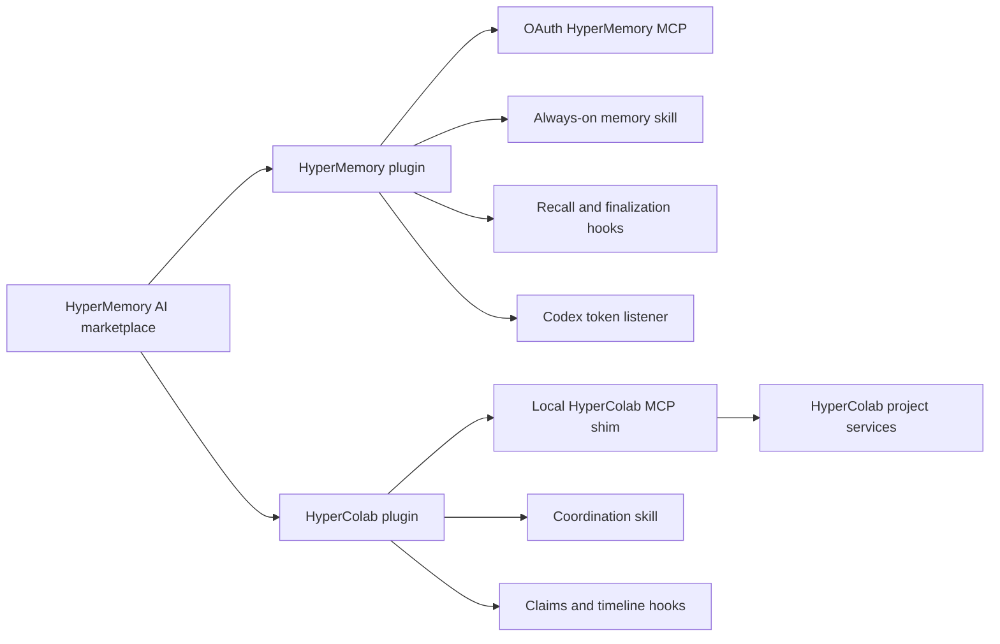

<p align="center">
  
  &nbsp;&nbsp;&nbsp;&nbsp;
  
</p>

<h1 align="center">HyperMemory AI plugins for ChatGPT & Codex</h1>

<p align="center">
  One public marketplace. Two focused plugins. Durable memory for every turn,
  and coordinated development for every repository.
</p>

<p align="center">
  <a href="https://github.com/hypermemory-ai/hm-plugins-openai/actions/workflows/validate.yml"></a>
  <a href="LICENSE"></a>
</p>

## The marketplace

| Plugin | What it adds | Best for |
| --- | --- | --- |
| **HyperMemory** | OAuth MCP, relationship-aware recall, delegated memory writing, lifecycle hooks, and privacy-preserving token telemetry | Keeping personal and project context available across chats and sessions |
| **HyperColab** | Project-aware MCP shim, shared graph and timeline, work claims, collision-prevention hooks, Git activity capture, and coordination-agent guidance | Coordinating developers and coding agents working in the same repository |

The two plugins are independent. Install either one or both from the same
`hypermemory-ai` marketplace.

## Quick start

Add this repository as a plugin source once:

```bash
codex plugin marketplace add hypermemory-ai/hm-plugins-openai
```

Install HyperMemory:

```bash
codex plugin add hypermemory@hypermemory-ai
```

Install HyperColab's local CLI/MCP shim, then its plugin:

```bash
pipx install "git+https://github.com/hypermemory-ai/hm-plugins-openai.git#subdirectory=packages/hypercolab-cli"
hypercolab login
codex plugin add hypercolab@hypermemory-ai
```

Finally, start a new task. In Codex CLI, run `/hooks`, review the bundled hook
definitions, and trust the ones you want active. Codex intentionally does not
run new or changed non-managed hooks until you approve their exact definition.

See [Installation](docs/INSTALLATION.md) for OAuth, verification, updates,
ChatGPT surface notes, and troubleshooting.

## How the pieces fit



HyperMemory keeps recall on the main agent so remembered context can influence
the answer. Durable writes, timeline updates, and token reporting are delegated
to a bounded memory-writer sub-agent. HyperColab follows the same separation:
join, sync, and claims stay on the main agent, while routine project-timeline
maintenance can be delegated to a coordination writer.

## Repository layout

```text
.agents/plugins/marketplace.json      Shared marketplace catalog
plugins/hypermemory/                  HyperMemory OpenAI plugin
plugins/hypercolab/                   HyperColab OpenAI plugin
packages/hypercolab-cli/              HyperColab CLI and local stdio MCP shim
docs/                                 Installation and architecture guides
scripts/build_plugin_archives.py      Reproducible review ZIP builder
tests/                                Marketplace and lifecycle tests
```

Each plugin contains its required `.codex-plugin/plugin.json`, MCP
configuration, skill, hook definition, assets, and an `agents/` role contract.
The skills reference those roles because the OpenAI plugin manifest does not
currently define a separate auto-installed custom-agent registry.

## ChatGPT and Codex

This repository is the Git-backed marketplace and source package used for
development, Codex installation, and workspace testing. Public one-click
installation in both ChatGPT and Codex requires publishing each plugin through
OpenAI's universal Plugins Directory.

HyperMemory's hosted MCP is ready for the **With MCP** submission path.
HyperColab uses a local stdio shim to resolve the active Git repository, so its
full coordination behavior requires a local coding surface that can launch the
`hypercolab` command.

## Privacy by design

- OAuth credentials are handled by the MCP or HyperColab CLI and are never
  committed to this repository.
- HyperMemory's Codex listener parses token counters only. It does not return
  or upload prompts, responses, tool arguments, tool results, or source code.
- HyperColab records structured summaries, paths, commits, claims, and visible
  rationale. It does not send raw source, raw diffs, transcripts, or hidden
  reasoning by default.
- Plugin hooks require explicit trust in Codex and can be reviewed or disabled
  with `/hooks`.

Read [Architecture](docs/ARCHITECTURE.md), [Marketplace maintenance](docs/MARKETPLACE.md),
and [Security](SECURITY.md) for the full operational model.

## Development

```bash
python -m pip install -e "packages/hypercolab-cli[dev]"
ruff check plugins packages tests scripts
pytest -q
python scripts/build_plugin_archives.py
```

Codex's authoring validators are also supported:

```bash
python3 ~/.codex/skills/.system/plugin-creator/scripts/validate_plugin.py plugins/hypermemory
python3 ~/.codex/skills/.system/plugin-creator/scripts/validate_plugin.py plugins/hypercolab
python3 ~/.codex/skills/.system/skill-creator/scripts/quick_validate.py plugins/hypermemory/skills/hypermemory
python3 ~/.codex/skills/.system/skill-creator/scripts/quick_validate.py plugins/hypercolab/skills/hypercolab
```

## License

MIT. See [LICENSE](LICENSE).
