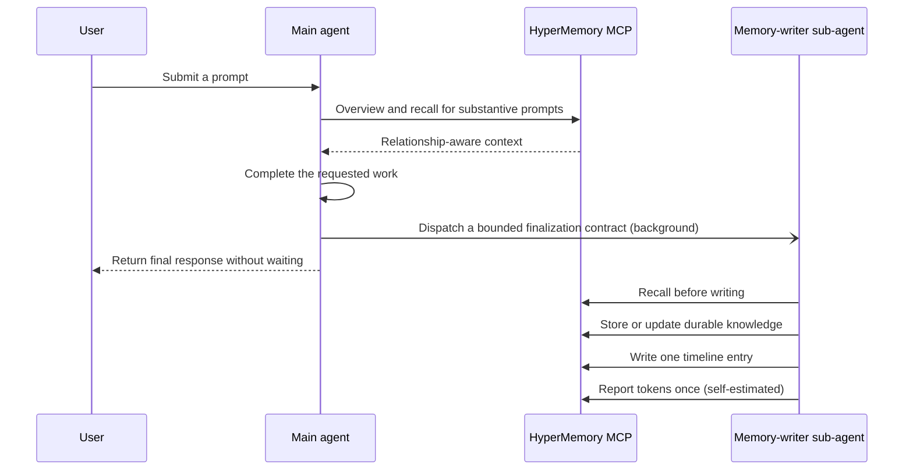
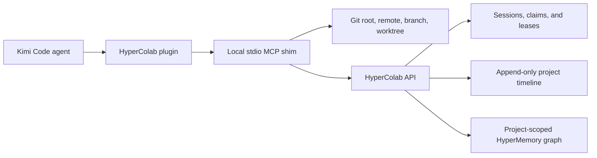

<p align="center">
  
  &nbsp;&nbsp;&nbsp;&nbsp;
  
</p>

<h1 align="center">HyperMemory AI plugins for Kimi Code</h1>

<p align="center">
  Durable, relationship-aware memory for every session.<br />
  Shared project context and collision-safe coordination for every repository.
</p>

<p align="center">
  <a href="https://github.com/hypermemory-ai/hm-plugins-openai/actions/workflows/validate.yml"></a>
  <a href="LICENSE"></a>
  
  
</p>

> [!IMPORTANT]
> This repository packages HyperMemory and HyperColab as Kimi Code plugins.
> HyperMemory currently connects to the hosted staging MCP at
> `https://stage.hypermemory.io/mcp`.

## Contents

- [What this repository provides](#what-this-repository-provides)
- [Why two plugins?](#why-two-plugins)
- [Capability matrix](#capability-matrix)
- [Quick start](#quick-start)
- [HyperMemory](#hypermemory)
- [HyperColab](#hypercolab)
- [Repository layout](#repository-layout)
- [Agent role packaging](#agent-role-packaging)
- [Authentication and secrets](#authentication-and-secrets)
- [Updating](#updating)
- [Removing](#removing)
- [Development](#development)
- [Troubleshooting](#troubleshooting)
- [Frequently asked questions](#frequently-asked-questions)
- [Documentation](#documentation)
- [Support and security](#support-and-security)

## What this repository provides

This repository is one marketplace catalog containing two independently
installable Kimi Code plugins:

| Plugin | Plugin ID | Current version | Purpose |
| --- | --- | ---: | --- |
| **HyperMemory** | `hypermemory` | `2.9.2` | Persistent personal and project memory, relationship-aware recall, quality-gated delegated writes, timeline logging, and token telemetry |
| **HyperColab** | `hypercolab` | `2.8.0` | Shared project context, work ownership, path claims, project timelines, graph search, and multi-agent collision prevention |

```text
GitHub repository                    Marketplace catalog        Installable plugins
hypermemory-ai/hm-plugins-openai  ->  .agents/plugins/     ->  hypermemory
                                     marketplace.json          hypercolab
```

Browse the catalog with `/plugins marketplace <path-or-url>`; installing a
plugin is a separate, explicit step.

## Why two plugins?

HyperMemory and HyperColab share a graph-oriented foundation, but they solve
different problems and have different runtime boundaries:

- **HyperMemory follows a person or agent across conversations.** It recalls
  durable context before work begins and maintains that context after each
  turn.
- **HyperColab follows a Git project.** It resolves the active repository,
  coordinates concurrent developers and coding agents, protects claimed paths,
  and records a structured development timeline.

Keeping them separate lets a user install durable memory without repository
coordination, add coordination only where needed, or run both together.

## Capability matrix

| Capability | HyperMemory | HyperColab |
| --- | :---: | :---: |
| Hosted OAuth MCP | Yes | No |
| Local stdio MCP shim | No | Yes |
| Bundled skills | Main agent + memory writer | Coordination |
| Lifecycle hooks (manifest-declared) | Yes | Yes |
| Packaged custom agent | Memory writer | Coordination writer |
| Relationship-aware graph | Personal and cross-session | Project-scoped |
| Chronological timeline | Conversation and decision timeline | Development activity timeline |
| Token telemetry | Honest self-estimated reports | No |
| Path claims and collision protection | No | Yes |
| Git event capture | No | Optional |
| Works without the other plugin | Yes | Yes |

## Quick start

### Prerequisites

- A current Kimi Code CLI
- A HyperMemory account
- Git
- Python 3.10 or newer and [`pipx`](https://pipx.pypa.io/) for HyperColab

### 1. Browse the catalog

From a checkout of this repository, in a Kimi Code session:

```text
/plugins marketplace ./.agents/plugins/marketplace.json
```

### 2. Install HyperMemory

```text
/plugins install ./plugins/hypermemory
/reload
```

Complete the HyperMemory OAuth flow with `/mcp-config login hypermemory` when
prompted, then start a new session.

### 3. Install HyperColab

HyperColab needs its local CLI/MCP shim before Kimi Code loads the plugin:

```bash
pipx install "git+https://github.com/hypermemory-ai/hm-plugins-openai.git#subdirectory=packages/hypercolab-cli"
hypercolab login
hypercolab doctor
```

```text
/plugins install ./plugins/hypercolab
/reload
```

Start a new session inside a Git repository that is enrolled in HyperColab.

### 4. Verify the installation

```text
/plugins list
/mcp
```

```bash
hypercolab status
```

Try these prompts in a new session:

```text
What do you remember about this project?
```

```text
Join this HyperColab project, sync active work, and claim the files needed for my task.
```

For a step-by-step guide, see [Installation](docs/INSTALLATION.md).

## HyperMemory

HyperMemory adds durable, relationship-aware memory to Kimi Code. It is
designed to recall the right context before a response and preserve important
knowledge after the requested work is complete.

### Included components

| Component | Path | Responsibility |
| --- | --- | --- |
| Plugin manifest | `plugins/hypermemory/kimi.plugin.json` | Identity, version, skills, agent, hooks, MCP declaration, and system-prompt contribution |
| Main-agent skill | `plugins/hypermemory/skills/hypermemory/` | Defines recall and fire-and-forget delegation behavior |
| Memory-writer skill | `plugins/hypermemory/skills/memory-writer/` | Parent-only finalization workflow with model invocation disabled |
| Memory-writer agent | `plugins/hypermemory/agents/memory-writer.md` | Delegatable sub-agent whose body makes the writer skill the sole contract |
| Plugin instructions | `plugins/hypermemory/SYSTEM.md` | Always-on recall/delegate rules contributed via `systemPromptPath` |
| Lifecycle hooks | manifest `hooks` array | Inject recall classification and dispatch instructions before model work |
| Hook bridge | `plugins/hypermemory/scripts/hypermemory_hook.py` | Classifies prompts and emits concise context, failing open |

### Turn lifecycle



The main agent performs recall for substantive prompts because remembered
context must be available while reasoning about the user's request. Narrow,
standalone greetings and acknowledgements skip retrieval. Persistence and
telemetry move to one fire-and-forget memory-writer sub-agent so they do not
delay the user-facing response. Each turn uses a fresh, turn-unique writer; the
agent's tool list (MCP only, no further delegation) prevents recursive
delegation.

This coordination is deliberately invisible in normal use. HyperMemory does
not emit status messages, inject synthetic user prompts, or append memory
completion notices to user-facing answers.

### Memory operations

The skill uses the HyperMemory MCP for:

- graph overview and relevant recall;
- exact-node hydration and relationship traversal;
- durable storage and correction of existing knowledge;
- graph relationships and orphan cleanup;
- chronological timeline entries;
- user-requested file storage; and
- per-turn token telemetry.

Writes follow canonical node types and stable keys. The writer recalls before
changing the graph, updates existing nodes instead of duplicating them, and
gives each new node a specific relationship. File upload is used only when
the user explicitly asks to store a file.

### OAuth and credentials

The plugin connects to:

```text
https://stage.hypermemory.io/mcp
```

The hosted MCP supports authorization-code OAuth with PKCE and refresh
tokens. Kimi Code owns client metadata, callback selection, and credential
storage for its surface. The plugin package contains only the server URL; it
does not contain or require a checked-in API key.

### Token telemetry

Kimi Code does not expose local exact-usage counters to plugins. The
memory-writer therefore submits one honest `self_estimated` report per turn.
Optional `uncertainty_percentage` and `cost_usd` fields are omitted unless they
can be determined defensibly, and `cost_quality` reports `unavailable` when no
cost is supplied. The plugin never invents an account identifier, provider
event, exact cost, exact token count, or uncertainty.

### Always-on behavior and its boundary

HyperMemory uses three complementary layers:

1. The skill declares itself applicable on every turn.
2. Session and prompt hooks inject concise recall and dispatch instructions,
   and the `systemPromptPath` file contributes the same rules to the system
   prompt.
3. The skill requires delegated memory finalization before the response is
   released; no blocking `Stop` continuation is used.

This is the strongest enforcement available to an installed plugin, but it is
not an operating-system guarantee. If the plugin is disabled, hooks are
disabled by policy, the MCP is unavailable, or the current surface cannot
spawn sub-agents, behavior degrades accordingly. The skill keeps recall
available when possible and does not claim that background persistence
occurred when delegation is unavailable.

## HyperColab

HyperColab coordinates human developers and coding agents working in the same
Git project. It combines shared context, explicit work ownership, atomic path
claims, structured activity, and project-scoped graph search.

### Included components

| Component | Path | Responsibility |
| --- | --- | --- |
| Plugin manifest | `plugins/hypercolab/kimi.plugin.json` | Identity, version, skills, agent, hooks, and inline stdio MCP registration |
| Skill | `plugins/hypercolab/skills/hypercolab/` | Defines join, sync, claim, progress, activity, and completion behavior |
| Coordination-writer agent | `plugins/hypercolab/agents/coordination-writer.md` | Bounded delegatable role for timeline maintenance |
| Lifecycle hooks | manifest `hooks` array | Loads project context, checks writes, and records structured activity |
| Hook launcher | `plugins/hypercolab/scripts/hypercolab_hook.py` | Bridges lifecycle events to the installed CLI and degrades safely if absent |
| CLI and MCP shim | `packages/hypercolab-cli/` | OAuth, Git discovery, MCP tools, direct commands, claims, offline leases, and Git hooks |

### Why a local shim?

HyperColab must know which repository the user is actually working in. The
local shim derives the Git root, canonical remote, branch, and worktree before
calling the project service. Agents do not select arbitrary graph or timeline
database identifiers.



This routing is a safety boundary: the backend resolves the authorized project
from the authenticated developer and canonical repository identity.

### MCP tool reference

| Tool | Purpose |
| --- | --- |
| `colab_join` | Join the project associated with the current Git repository and publish the work goal |
| `colab_sync` | Retrieve active sessions, ownership, recent events, and touch/do-not-touch guidance |
| `colab_claim` | Atomically claim repository-relative files or directories before editing |
| `colab_check` | Check create, modify, rename, or delete operations immediately before a write |
| `colab_update` | Publish material progress, scope, status, rationale, and claim renewal |
| `colab_finish` | Complete, release, abandon, or hand off work and release the claim |
| `colab_log_activity` | Append a structured project event for decisions, discoveries, tests, commits, or releases |
| `colab_timeline` | Read or search the chronological development record |
| `colab_graph_search` | Search durable knowledge in the project-scoped graph |

### Coordination lifecycle

The main agent joins and synchronizes before planning, then claims intended
paths before editing. Join, sync, and claim operations stay on the main agent
because their results affect planning and write safety. Routine progress and
timeline maintenance may be delegated to one awaited coordination writer.

```text
join -> sync -> claim -> check before writes -> update during work -> finish or hand off
```

Live conflicts are not bypassed. If another session owns an overlapping path,
the agent coordinates a handoff, waits for lease expiry, or changes scope.

### Lifecycle and Git hooks

The plugin hooks cover:

- `SessionStart`: load the current project brief;
- `PreToolUse`: check inferred file operations and claims before writes;
- `PostToolUse`: record structured completion or Git-push events; and
- `Stop`: record that the coding session stopped.

The optional repository Git hooks record non-blocking events such as commits,
checkouts, merges, rewrites, and pushes:

```bash
hypercolab hooks install
```

Remove them before uninstalling the CLI:

```bash
hypercolab hooks uninstall
```

### Offline behavior

HyperColab treats coordination conservatively during an outage:

- new path claims fail closed;
- a previously approved cached lease is honored only until its server-issued
  expiration;
- Git activity is queued locally and retried later; and
- repositories that are not registered with HyperColab remain unaffected.

### Data boundary

HyperColab records structured summaries, repository-relative paths, commit
identifiers, claims, statuses, test results, small metadata objects, and visible
rationale summaries. By default it does not send raw source, raw diffs, full
shell output, complete transcripts, or hidden model reasoning.

## Repository layout

```text
.
├── .agents/plugins/marketplace.json       # Kimi marketplace catalog
├── .github/workflows/validate.yml         # Lint, test, and archive CI
├── plugins/
│   ├── hypermemory/
│   │   ├── kimi.plugin.json               # HyperMemory manifest
│   │   ├── SYSTEM.md                      # System-prompt contribution
│   │   ├── agents/                        # Memory-writer agent
│   │   ├── assets/                        # Icon and logo
│   │   ├── scripts/                       # Hook bridge
│   │   └── skills/                        # Main-agent and parent-only writer skills
│   └── hypercolab/
│       ├── kimi.plugin.json               # HyperColab manifest
│       ├── agents/                        # Coordination-writer agent
│       ├── assets/                        # Icon and logo
│       ├── scripts/                       # Graceful hook launcher
│       └── skills/hypercolab/             # Coordination workflow and references
├── packages/hypercolab-cli/               # Installable CLI and local MCP shim
├── docs/
│   ├── ARCHITECTURE.md                    # Runtime design and trust boundaries
│   ├── INSTALLATION.md                    # Detailed setup and troubleshooting
│   └── MARKETPLACE.md                     # Catalog and release maintenance
├── scripts/build_plugin_archives.py       # Deterministic review ZIP builder
├── tests/                                 # Marketplace and lifecycle tests
├── AGENTS.md                              # Repository rules for coding agents
├── CONTRIBUTING.md                        # Contribution and release checklist
├── SECURITY.md                            # Vulnerability reporting and boundaries
└── LICENSE                                # MIT license
```

## Agent role packaging

Each plugin ships a custom agent under `agents/`, which Kimi Code discovers
automatically as delegatable sub-agents while the plugin is enabled:

- HyperMemory uses `memory-writer` for storage, timeline, and telemetry. Its
  tool allowlist grants only `mcp__hypermemory__*` and forbids further
  delegation.
- HyperColab uses `coordination-writer` for project activity maintenance. Its
  tool allowlist grants read-only file tools plus the HyperColab MCP server,
  and forbids shell access and further delegation.

Plugin agents rank below every other agent file source, so they can never
shadow user-level or project agents. The skills control when delegation
happens and what information is passed.

## Authentication and secrets

| Component | Authentication | Where credentials live |
| --- | --- | --- |
| HyperMemory MCP | OAuth authorization code with PKCE | Kimi Code MCP credential storage |
| HyperColab CLI | `hypercolab login` OAuth flow with PKCE | OS keyring, with a restricted local fallback when no keyring is available |
| Git marketplace | Public GitHub repository | No credentials required for this repository |

No access token, refresh token, client secret, API key, or reviewer credential
belongs in this repository. See [Security](SECURITY.md) for reporting and trust
boundaries.

## Updating

Reinstall the plugins you use and reload:

```text
/plugins install ./plugins/hypermemory
/plugins install ./plugins/hypercolab
/reload
```

```bash
pipx upgrade hypercolab
```

Local installations are copied to `$KIMI_CODE_HOME/plugins/managed/<id>/`;
editing the original source directory after installation has no effect, so a
reinstall is required to pick up changes.

HyperMemory lifecycle preparation fails open: a local hook error is reported
for diagnosis, but the hook returns non-blocking output so the user's turn
continues without claiming that lifecycle preparation succeeded.

## Removing

If you installed HyperColab Git hooks, remove those first while the CLI is still
available:

```bash
hypercolab hooks uninstall
```

Then remove the plugins and optional CLI:

```text
/plugins remove hypermemory
/plugins remove hypercolab
```

```bash
pipx uninstall hypercolab
```

Removing a plugin only deletes the installation record; the managed copy and
original source files remain on disk. Removing the plugins does not delete
durable data already stored by HyperMemory or HyperColab.

## Development

### Clone and create an environment

```bash
git clone https://github.com/hypermemory-ai/hm-plugins-openai.git
cd hm-plugins-openai
python3 -m venv .venv
source .venv/bin/activate
python -m pip install -e "packages/hypercolab-cli[dev]"
```

### Run the test suite

```bash
ruff check plugins packages tests scripts
pytest -q
```

The tests cover:

- catalog-to-plugin path and identity consistency;
- required manifests, MCP declarations, hooks, skills, and assets;
- HyperMemory prompt classification and fire-and-forget writer delegation;
- HyperColab hook behavior, Git discovery, cached leases, and queued events;
- logo format and dimensions; and
- graceful behavior when the HyperColab CLI is missing.

### Build review archives

```bash
python scripts/build_plugin_archives.py
```

This creates deterministic ZIP archives in `dist/`. Marketplace installation
uses the source directories referenced by `marketplace.json`, so checked-in
archives are not required. Generated archives remain ignored to avoid stale
binary packages.

## Troubleshooting

### The marketplace was added, but no plugin is installed

That is expected. Browsing the catalog adds it only. Install a plugin
explicitly:

```text
/plugins install ./plugins/hypermemory
```

### MCP tools are missing

Confirm that the plugin is installed and enabled with `/plugins list`, then run
`/reload` or start a new session. HyperColab also requires the `hypercolab`
executable to be on `PATH`; run `hypercolab doctor` to verify its
prerequisites.

### HyperMemory OAuth did not open

Run `/mcp-config login hypermemory` and complete the browser flow. Confirm the
installed MCP URL is `https://stage.hypermemory.io/mcp` and check
`/plugins info hypermemory` diagnostics.

### HyperColab authentication failed

Run:

```bash
hypercolab login
hypercolab doctor
hypercolab status
```

The local callback needs an available loopback port and a browser capable of
completing OAuth.

### Hooks do not run

Confirm the plugin is enabled in `/plugins` and check `/plugins info <id>`
diagnostics. Plugin hooks are active only while the plugin is enabled and fire
when their matching lifecycle event occurs.

### A HyperColab write is blocked

Run `hypercolab sync` to inspect active ownership and claims. Coordinate a
handoff, wait for the conflicting lease to expire, or change the intended path.
Do not bypass a valid ownership conflict.

### The plugin changed but the session still uses the old copy

Run `/plugins reload`, then `/reload` or start a new session. Local
installations run from the managed copy under
`$KIMI_CODE_HOME/plugins/managed/<id>/`, so source edits require a reinstall.

### Exact token reporting is unavailable

That is expected on this surface: Kimi Code does not expose local exact-usage
counters to plugins. The memory-writer submits one uncertainty-labelled
self-estimate instead and never claims client-exact usage.

## Frequently asked questions

### Is the marketplace itself a plugin?

No. The catalog lists the separate `hypermemory` and `hypercolab` plugins.

### Do I need both plugins?

No. HyperMemory and HyperColab are independent. Install only the capabilities
you need.

### Does HyperColab replace HyperMemory?

No. HyperColab uses project-scoped knowledge and coordination. HyperMemory is
the durable cross-conversation memory plugin. They complement one another.

### Are the packaged `agents/` files registered custom agents?

Yes — while the plugin is enabled, Kimi Code discovers each `agents/*.md` file
as a delegatable sub-agent. They rank below user and project agents and cannot
override them.

### Does token telemetry upload my conversations?

No. The writer reports only a self-estimated activity summary with the turn's
token telemetry envelope. It does not upload chat content, tool payloads, or
source code.

### Is the MCP endpoint production?

No. The checked-in HyperMemory configuration currently targets the hosted
staging endpoint. Treat the package as pre-production until the manifest and
docs are updated to a production MCP URL.

## Documentation

- [Detailed installation and troubleshooting](docs/INSTALLATION.md)
- [Architecture and trust boundaries](docs/ARCHITECTURE.md)
- [Marketplace and release maintenance](docs/MARKETPLACE.md)
- [HyperMemory package notes](plugins/hypermemory/README.md)
- [HyperColab package notes](plugins/hypercolab/README.md)
- [Contribution guide](CONTRIBUTING.md)
- [Security policy](SECURITY.md)

For the Kimi Code plugin model, see the
[official plugin documentation](https://www.kimi.com/code/docs/en/kimi-code-cli/customization/plugins.html).

## Support and security

For general project questions, use the repository's GitHub issues. Do not post
credentials, tokens, private repository content, or vulnerability details in a
public issue.

Report security concerns privately according to [SECURITY.md](SECURITY.md).
Legal and product information is available at:

- [HyperMemory AI](https://hypermemory.io)
- [Privacy policy](https://hypermemory.io/privacy)
- [Terms of service](https://hypermemory.io/terms)

## License

Licensed under the MIT License. See [LICENSE](LICENSE).
