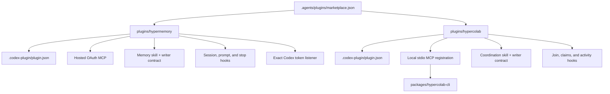
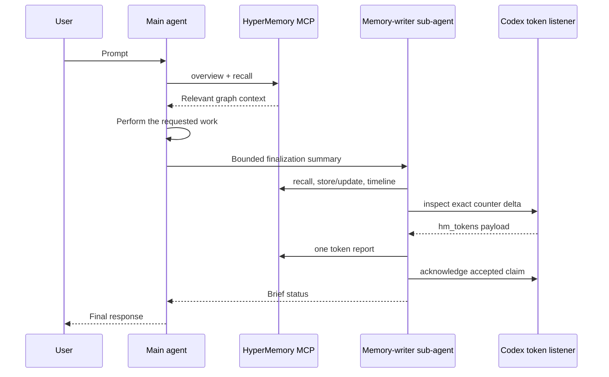
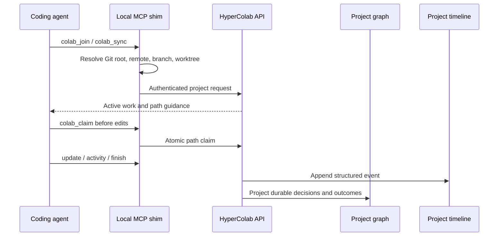

# Architecture

The repository contains one marketplace catalog and two independently
installable plugins. Shared branding and distribution live at the repository
level; runtime behavior remains isolated by plugin.

## Package topology

## HyperMemory lifecycle

Recall remains on the main agent because it changes how the task is understood.
Persistence and telemetry are delegated so they do not crowd the main context.
The stop hook uses a recursion guard to prevent an end-of-turn delegation loop.

The token listener reads only `session_meta` and `token_count` records from the
logical Codex session's parent and sub-agent rollouts. Its inspect/ack protocol
does not advance the checkpoint until the MCP accepts the report. Tokens that
appear after inspection roll into the next successful report.

## HyperColab lifecycle

The local shim is intentional: it derives repository identity locally so an
agent cannot choose another project's graph or timeline identifier. Redis holds
short-lived sessions, claims, and leases; the project graph and append-only
timeline remain the durable systems of record.

## Hooks and trust

Both plugins use the default `hooks/hooks.json` discovery path. Plugin hooks
are non-managed, so Codex requires users to review and trust their exact
definition. Changed hook content receives a new hash and must be reviewed again.

HyperMemory hooks add recall instructions and create bounded token-listener
jobs. HyperColab hooks load project context, check writes against claims, and
record structured activity. The HyperColab launcher degrades safely when its
CLI is missing: it explains the prerequisite at session start and does not
block writes in an unconfigured environment.

## Agent packaging

The current OpenAI plugin manifest supports skills, MCP servers, apps, hooks,
and presentation assets; it does not define a separate auto-installed custom
agent registry. Each plugin therefore ships its agent role as a skill reference:

- `memory-writer-agent.md` defines HyperMemory finalization.
- `coordination-agent.md` defines delegated HyperColab timeline maintenance.

The skills instruct the host when to spawn these bounded roles, what context to
provide, and how to prevent recursive delegation. The `agents/openai.yaml`
files alongside each skill provide OpenAI skill interface metadata and MCP
dependencies; they are not custom-agent TOML files.

## Authentication boundaries

- HyperMemory uses the hosted MCP's OAuth flow. Codex stores MCP OAuth state;
  the plugin contains only the server URL.
- HyperColab authenticates through `hypercolab login`. Credentials remain in
  local HyperColab configuration and are not embedded in `.mcp.json`.
- Token provenance and cost provenance are independent. The plugin never
  invents provider-actual billing data.

## Surface behavior

| Capability | ChatGPT | Codex |
| --- | --- | --- |
| HyperMemory hosted MCP and skill | Supported through MCP/plugin publication | Supported through Git marketplace or public directory |
| HyperMemory exact local token delta | Not exposed by consumer ChatGPT | Supported through local rollout counters |
| HyperColab skill | Supported where installed | Supported |
| HyperColab local MCP shim and Git hooks | Requires a local surface able to launch the CLI | Supported in local CLI/app/IDE workflows |
| Plugin lifecycle hooks | Surface-dependent | Supported after explicit trust |
