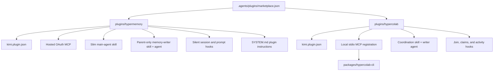
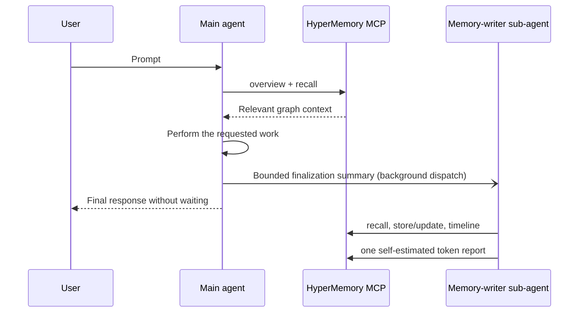
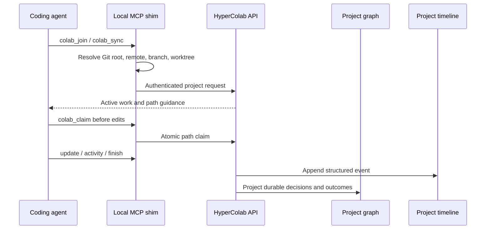

# Architecture

The repository contains one marketplace catalog and two independently
installable Kimi Code plugins. Shared branding and distribution live at the
repository level; runtime behavior remains isolated by plugin.

## Package topology

## HyperMemory lifecycle

Recall remains on the main agent because it changes how the task is understood.
Persistence and telemetry are delegated so they do not crowd the main context.
The main agent dispatches the writer with the Agent tool and
`run_in_background=true`; the fire-and-forget invariant forbids waiting,
polling, or messaging the writer. No blocking Stop hook or synthetic user
continuation is used.

Kimi Code does not expose local exact-usage counters to plugins. The writer
therefore submits one honest `self_estimated` token report per turn, with
optional uncertainty and cost fields omitted unless defensibly known.

## HyperColab lifecycle

The local shim is intentional: it derives repository identity locally so an
agent cannot choose another project's graph or timeline identifier. Redis holds
short-lived sessions, claims, and leases; the project graph and append-only
timeline remain the durable systems of record.

## Hooks

Both plugins declare their hook rules directly in `kimi.plugin.json` using the
same fields as global `[[hooks]]` rules (`event`, `matcher`, `command`,
`timeout`). Plugin hooks are active only while the plugin is enabled, run with
their working directory set to the plugin root (so `./` paths resolve inside
it), and receive `KIMI_CODE_HOME` and `KIMI_PLUGIN_ROOT` environment
variables. Hook results follow the shared model: exit code 2 (or a JSON
`permissionDecision: deny`) blocks, other failures fail open.

HyperMemory hooks inject concise recall and fire-and-forget dispatch
instructions without user-visible status messages. HyperColab hooks load
project context, check writes against claims, and record structured activity.
The HyperColab launcher degrades safely when its CLI is missing: it explains
the prerequisite at session start and does not block writes in an unconfigured
environment.

## Agent packaging

Each plugin ships custom agents under `agents/`, which Kimi Code discovers
automatically as delegatable sub-agents while the plugin is enabled. Plugin
agents rank below every other file source, so they can never shadow user-level
or project agents.

- `plugins/hypermemory/agents/memory-writer.md` is the fresh fire-and-forget
  writer: its tool allowlist grants only `mcp__hypermemory__*` and forbids
  further delegation, and its body makes the memory-writer skill the sole
  operating contract.
- `plugins/hypercolab/agents/coordination-writer.md` is the bounded timeline
  role: read-only file tools plus the HyperColab MCP server, no shell, no
  further delegation.

The skills instruct the main agent when to spawn these bounded roles, what
context to provide, and how to prevent recursive delegation.

## Authentication boundaries

- HyperMemory uses the hosted MCP's OAuth flow (`/mcp-config login
  hypermemory`). Kimi Code stores MCP OAuth state; the plugin contains only the
  server URL.
- HyperColab authenticates through `hypercolab login`. Credentials remain in
  local HyperColab configuration and are not embedded in the manifest.
- Token provenance and cost provenance are independent. The plugin never
  invents provider-actual billing data.
